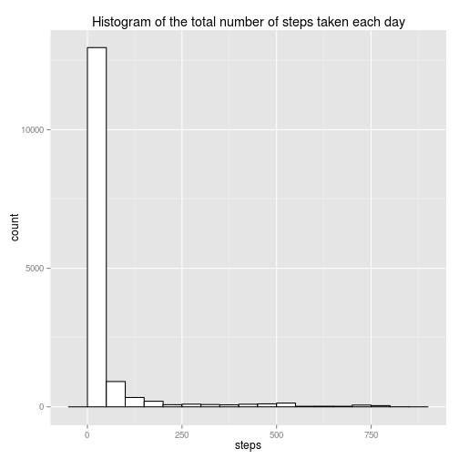
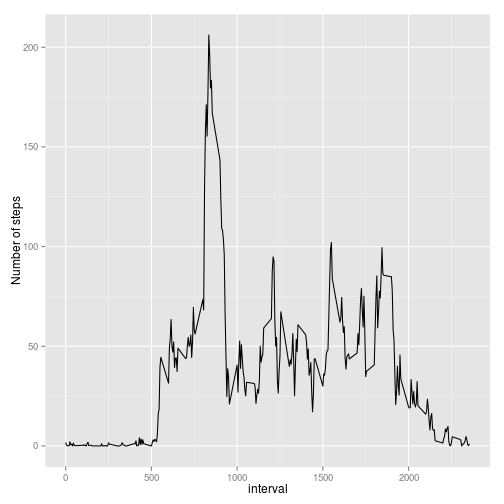
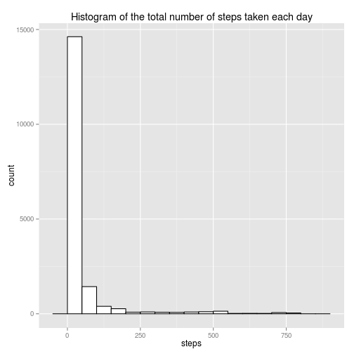
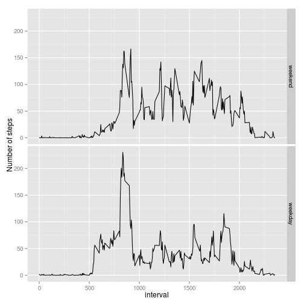

### Loading and preprocessing the data


```r
setwd("/home/benybrahim/Bureau")
library("ggplot2")
library("plyr")
temp <- tempfile()
download.file("https://d396qusza40orc.cloudfront.net/repdata%2Fdata%2Factivity.zip",
              temp,method = "curl")
activity <- read.csv(unz(temp, "activity.csv"),header=T)
unlink(temp)
activity$date <- as.Date(activity$date,"%Y-%m-%d")
```

### Mean total number of steps taken per day


```r
with(activity,sum(steps,na.rm=T))       # Total of the number of steps taken per day
```

```
## [1] 570608
```

```r
# Make a histogram of the total numberof steps taken each day
qplot(steps,data=activity,
      main = "Histogram of the total number of steps taken each day",
      binwidth=50,
      color = I("black"),
      fill=I("white"))  
```

 

```r
with(activity,mean(steps,na.rm=T))       # Mean of the number of steps taken per day
```

```
## [1] 37.3826
```

```r
with(activity,median(steps,na.rm=T))     # Median of the number of steps taken per day
```

```
## [1] 0
```

### Average daily activity pattern


```r
# Time series plot
table <- ddply(activity , "interval",  summarise, mean = mean(steps,na.rm=T))
qplot(interval,mean,data=table, geom="line",ylab="Number of steps") 
```

 

```r
activity$interval[which.max(table$mean)]       # 5-min interval that contain the maximum number of steps
```

```
## [1] 835
```

### Imputing missing values


```r
sum(is.na(activity$steps))      # The total number of missing values in the dataset
```

```
## [1] 2304
```

```r
# imputation by the average of steps by interval in a new dataset
activity.new <- activity
missing.values <- c()
for ( i in 1:sum(is.na(activity$steps))){
        intervals <- activity.new$interval[is.na(activity.new$steps)][i]
        missing.values[i] <- table$mean[table$interval == intervals]
        }    
activity.new$steps[is.na(activity.new$steps)] <- missing.values  

# Make a histogram of the total numberof steps taken each day        
qplot(steps,data=activity.new,
      main = "Histogram of the total number of steps taken each day",
      binwidth=50,
      color = I("black"),
      fill=I("white"))  
```

 

```r
with(activity.new,mean(steps))       # Mean of the number of steps taken per day
```

```
## [1] 37.3826
```

```r
with(activity.new,median(steps))     # Median of the number of steps taken per day
```

```
## [1] 0
```

There is no difference between the two part of the assignement. The imputation don't change the mean and the median,it change just the total of steps.

### Differences in activity patterns between weekdays and weekends


```r
# creating week
day <- as.factor(weekdays(activity.new$date))
day <- revalue(day, c("lundi"="weekday", "mardi"="weekday","mercredi"="weekday",
                "jeudi"="weekday","vendredi"="weekday","samedi"="weekend",
                "dimanche"="weekend"))
activity.new$day <- day

# Time series plot
table2 <- ddply(activity.new , c("interval","day"), summarise, mean = mean(steps))
qplot(interval,mean,data=table2,geom="line",facets =day~.,ylab= "Number of steps" ) 
```

 
